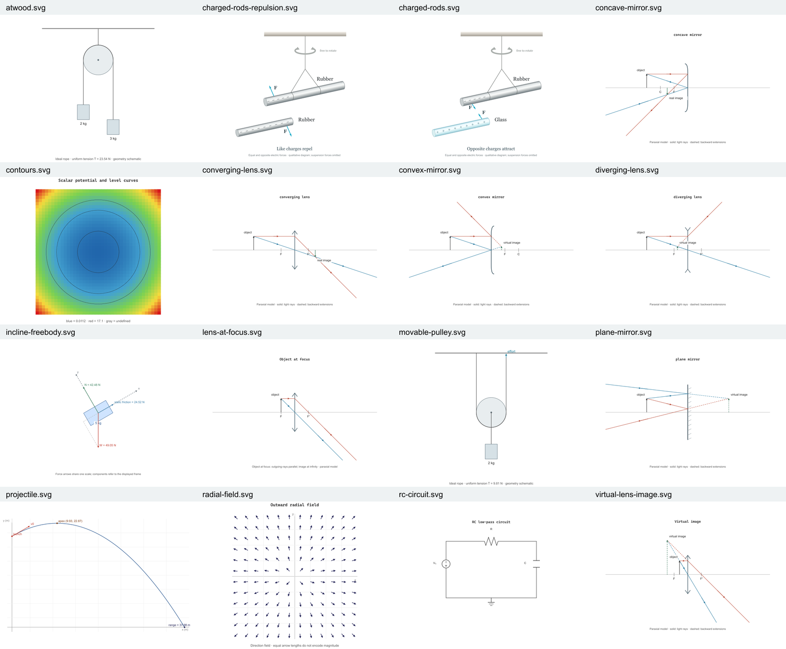

# Kinetra

Kinetra is a local TypeScript workbench for physics diagrams, circuit and Boolean tools, and technical learning workflows. Its core library, CLI, and Codex plugin live in one repository.

This is a source-run prototype. The diagram workflow below is tested; the repository is not a finished desktop application or a published npm package. Historical recovery notes and synthetic benchmarks are not feature or accuracy guarantees.

## Diagram examples

Sixteen reviewed examples cover charged rods, optics, projectile motion, forces, pulleys, fields and a circuit schematic.

[](docs/assets/diagram-review.png)

[Open the full-size preview](docs/assets/diagram-review.png) · [Review details and modeling assumptions](docs/diagrams.md#reviewed-examples--2026-09-07)

This is the saved visual review from September 7, 2026. Verification included 297 passing repository tests and nine passing accuracy probes; it does not certify every possible diagram input.

## Run a diagram

Use Node.js 25 or newer (verified on 25.8.1). The diagram renderer and tests run directly from TypeScript; they do not require a build or runtime dependency installation.

```sh
npm run diagram
```

This creates `out/diagrams/charged-rods.svg`: a shaded, suspended rubber rod and a nearby glass rod, with charge symbols and equal-and-opposite electric force arrows.

To edit the apparatus, change a copy of [the example JSON model](examples/charged-rods.json) and pass its path:

```sh
npm run diagram -- examples/charged-rods.json out/diagrams/custom.svg
npm run diagram -- --help
```

Generate the wider gallery:

```sh
npm run examples:diagrams
```

Open `out/diagrams/index.html` locally, or use the standalone SVGs. The gallery includes attraction and repulsion, lenses and mirrors, projectile motion, an incline FBD, fixed/movable pulley routes, fields and contours, and an RC schematic. Generated output belongs in the ignored `out/` directory; editable example input and generation code belong in `examples/`.

## Verify changes

```sh
npm test
npm run test:diagrams
npm run audit:diagrams
```

The audit checks actual SVG geometry, marker references, mirror signs, unsupported drag handling, and contours. It writes its results and examples to `out/diagram-audit/` and exits nonzero if any acceptance check fails.

For strict TypeScript checking of the diagram modules and their imported dependencies:

```sh
npm ci --ignore-scripts
npm run typecheck:diagrams
```

The npm lockfile pins development dependencies. The root uses Node's built-in test runner; the source loader in `scripts/` resolves `.js` import specifiers to their TypeScript source files. Package-level distribution builds are outside the verified source-run workflow.

## Diagram scope

These are model-driven renderers. They can illustrate the supported physical systems; they cannot infer arbitrary textbook scenes or prove a user-supplied set of forces is correct.

- Charged rods: qualitative distributed-charge interaction, shaded materials and suspension; no numerical electrostatic or torsion solver.
- Free-body diagrams: equal world-unit scaling, a common force-arrow scale, rotated frames and optional components.
- Projectiles: constant positive gravity, ground at y=0, no drag.
- Optics: ideal paraxial lenses and mirrors, principal rays, virtual extensions and image-at-infinity handling.
- Pulleys: defined fixed-wheel and single movable-wheel routes; unspecified compound routing is rejected.
- Fields: directional or magnitude arrows; scalar colors and piecewise-linear contours.
- Schematics: scaled component terminals and explicit wire routing; IEC-style logic symbols with distinct input pins.

See [diagram usage and assumptions](docs/diagrams.md) and the [audit with repair status](docs/textbook-diagram-audit.md). Correct calculations, SVG geometry and visual readability are separate checks; no universal accuracy percentage is claimed.

## Repository map

| Path | Purpose |
| --- | --- |
| `packages/core/src/` | Reusable engines; diagram code is in `diagram/` |
| `packages/core/test/` | Unit and regression tests |
| `packages/cli/src/` | CLI dispatch and workflows |
| `packages/plugin/` | Codex manifest, skills, metadata and plugin checks |
| `examples/` | Editable models and runnable example generation |
| `scripts/` | Source loader, diagram audit and preserved legacy recovery utilities |
| `benchmark/` | Historical benchmark fixtures and reports; read their caveats |
| `docs/` | Usage, audit findings and historical development notes |
| `out/` | Ignored generated diagrams, previews and check results |

## License

[MIT](LICENSE) © 2026 Mohamed Mowafy.
